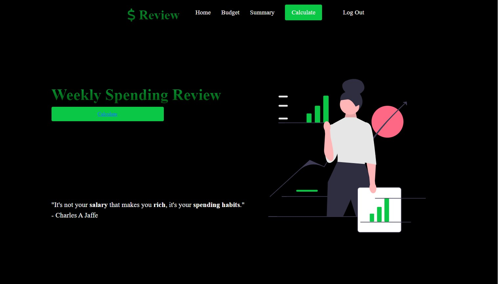

# Money REVIEW
#### Demo:  <https://www.youtube.com/watch?v=_W64huDytzk>
#### Live App:  <https://money-review-app.onrender.com>
<br />

### DESCRIPTION
------------
Money Review is a web-based application that combines HTML, CSS, JavaScript, Python, and SQL to provide users with a tool for calculating and managing their weekly spendings in a centralized platform.

This project was inspired by the weekly spending review my roommate and I conducted to manage our expenses. We realized that the process was consuming a significant amount of our time as we had to rely on various tools and visit multiple web pages. As a result, I embarked on creating a web-based application to streamline the process and boost efficiency. The goal for this project is to assist not only ourselves but also others in optimizing their time and enhancing efficiency when managing their expenses.


**Below is a preview image of the website's main page:**


<br />

### FEATURES
------------
* Ability to register/log in so that data will not get mixed up with other users
* Ability to add budget goals to each of the spending category
* Ability to remove items from Summary Page
* Ability to input unlimited spending items while seeing the total amount of each category populates
* A Summary Page that shows a simple yet detailed summary of each spending item that users inputed with a total budget and total amount spent on the top left corner

<br />

### EXECUTING PROGRAM
------------

#### Running the Program With Flask

* Make sure you're in the 'Final_Project' directory before running the flask command. After running the command, hold 'Ctrl' while clicking on the link to view the website.
  ```
  Final_Project/ $ flask run
  ```

#### Acessing SQL Database
* In order to access SQL database, you will need to run:
  ```
  Final_Project/ $ sqlite3 money_review.db
  ```
  * Once you're in sqlite3, run the command '.schema' to see what's inside the database

<br />

### NAVIGATING THE APPLICATION
------------
When the application is ran, users will be required to register/log in with username and password.

Once users are in, they could navigate to the Budget tab to start adding their weekly spending budget under each of the five given categories. For the sake of consistency and sorting in the Summary Page, users are only given five common categories such as grocery, eating out, entertainment, pet supply, and other. This will then populate into the Summary Page for users to reference later.

Next, users could go to the Calculate Page to start adding their spendings. There is no limit to the number of spending items users get to add. The sum for each category will then populate in a table underneath as users continue to add to the table.

As users are adding items to the Budget Page and the Calculate Page, these data are saved in the SQLite database and are populating in the Summary Page simultaneously. This page is designed to help users look at everything they inputed, as well as removing any items they no longer wanted.

<br />

### UNDERSTANDING THE FILES
------------
## **`app.py`**
<br />

The first thing you will see in this file are a bunch of imports that are helpful in later code. One of these imports is the Flask framework that is used in Python to make writing code simplier.

The next few lines of code show configuring of Flask and ensuring that the templates are auto-reloaded when changes are made to the templates. Then, the file configures `session` to use filesystem instead of Flask's default, signed cookies. This session also has default time limit in which it will expire. In the next line of code, the file configures CS50 Library to use SQLite database called `money_review.db`. The file also ensures users' responses are not cached to prevent different authenticated users from using each other's information. Moving on to the `login_required` function. The purpose of this function is to make sure that users must logged in before they can access certain routes.

The rest of the file contains nine routes that tell Flask when to call each function. Almost all of the routes support GET and POST method, which is a way to transfer data from users to server in HTTP protocol.

<br />

**Login**, **Logout**, **Register**

These three routes that do not have `login_required` function. Let's first take a look at the `login` route. This function unsures users input the correct username and password by using `db.execute` to query into `money_review.db`. This is where usernames and passwords are stored. Also, notice the function `check_password_hash` is used to compare users' hashed passwords. `Session` is used to remember which user has logged in. Next is the `logout` function where it simply uses `session.clear()` to log users out.

Moving on the register route. This route requires users to input a username, password, and confirmation password to sign up. It will render an error page called `error.html` if username/password has already been taken, left blank, or password and confirmation password do not match. In this function, it called the `generate_password_hash()` function to add a layer of security for the users. Once registered via POST, `db.execute` will INSERT the hashed password and username into a database called `users`.

<br />

**Home**, **Index**

The next two routes are solely directing users to the home page. The `home` function is called when users clicked on the home icon which will navigate them to the home page. The `index` function is the default page when users are logged in.

<br />

**Budget**

This first thing in this route is to obtain the user ID. This route requires users to input their weekly budget goals. Once they clicked done, `db.execute` will run and `UPDATE` the budget uniquely to the users into a database called `spendings`.

<br />

**Calculate**

This first thing in this route is to obtain the user ID. This route requires users to fill out the date, category, description, and amount of each spending item. Once they click submit, `db.execute` will run and `INSERT` the these items uniquely to the users into a database called `spendings`.

Each time users submit their spendings, `db.execute` will run and `SELECT` the `SUM` of each category and display them in a table on the website.

<br />

**Summary**

This first thing in this route is to obtain the user ID. This route does not require user inputs. `db.execute` will run and `SELECT` information to display on the page.

<br />

**Remove**

This route does not require user inputs. `db.execute` will run and `REMOVE` items from `spendings`.

<br />

## **`static/`**
<br />

This folder contains CSS files and picture files for HTML templates.

<br />

## **`templates/`**
<br />

This folder contains eight HTML files.

<br />

**Login, Register, Home**

Both are simply HTML forms with Bootstrap framework for template designs.

<br />

**Error**

Recall register and login routes in `app.py`, two arguments were passed into `render_template` which are `errors.html` and a variable called `message`. In `errors.html`, we were able to call `message` using Jinja.

<br />

**Layout**

This template has the navigation bar that all the other templates use. It uses Jinja's template inheritance to build a base layout that has all the common elements, then inserts blocks that child templates can add to the layout. The navigation bar is also compatible with mobile devices.

<br />

**Budget**

In this template, JavaScript was used to calculate the total budget amount and to create a pop-up alert letting users know that their inputs have been saved.

<br />

**Calculate**

In this template, JavaScript was used to create a pop-up alert letting users know that their inputs have been saved.

<br />

**Summary**

This template has a `remove` button where users can remove any items that they changed their minds on.

<br />

### AUTHOR
------------

Faith Le <br />
Email: lefaith12661@gmail.com <br />
Linkedin: [@Faith Le](https://www.linkedin.com/in/faithle/)
