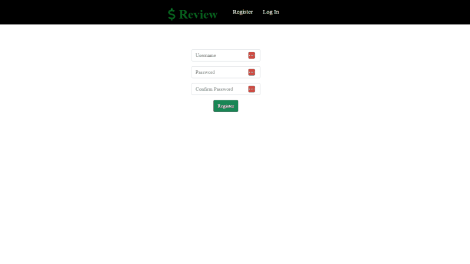
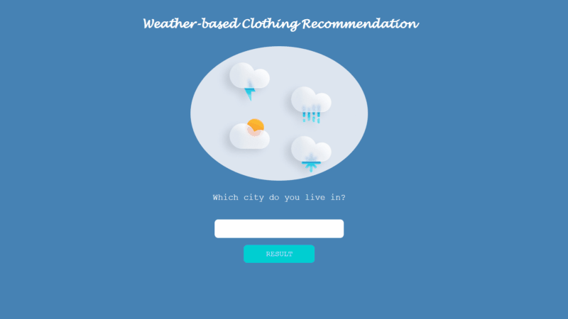

# Personal Projects

Welcome to my personal projects repository! This repository showcases various projects that I have built to enhance my programming skills and explore different technologies.

## About Me
---

I am a passionate developer who loves to dive into new technologies and expand my knowledge in the world of programming. This repository serves as a portfolio of my work, demonstrating my growth and the projects I have completed during my journey.

## Project List
---

    

- **[Money Review](https://github.com/lefaith12661/Personal_Projects/tree/main/Money_Review)**: A web-based application that combines HTML, CSS, JavaScript, Python, and SQL to provide users with a tool for calculating and managing their weekly spendings in a centralized platform.

    - [Project Demo](https://www.youtube.com/watch?v=_W64huDytzk&ab_channel=FaithLe)
    - [Try out the app!](https://money-review-app.onrender.com)
 

    

- **[Weather-based Clothing Recommendation](https://github.com/lefaith12661/Personal_Projects/tree/main/Weather-based_Clothing_Recommendation)**: A web-based application that utilizes HTML, CSS, Python, and a third-party API to offer users a tool that suggests suitable clothing based on the present weather conditions.
    - [Project Demo](https://www.youtube.com/watch?v=MZjEY1ef28U&ab_channel=FaithLe)
    - [Try out the app!](https://weather-based-clothing-recommendation-app.onrender.com)

## Getting Started
---

To explore any of the projects, simply navigate to the corresponding project folder and follow the instructions provided in the project's README. Each project folder contains its own README with detailed information on setup, usage, and any additional resources.

## Contact
---

Feel free to reach out to me if you have any questions or feedback. You can contact me via email at [lechau@umich.edu](mailto:lechau@umich.edu) or connect with me on [LinkedIn](https://www.linkedin.com/in/faithle/).

Thank you for visiting my personal projects repository!
