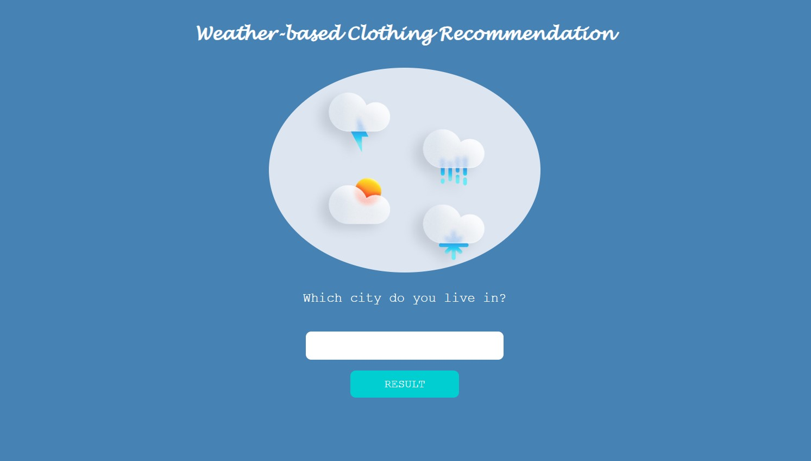

# WEATHER-BASED CLOTHING RECOMMENDATION
#### Demo:  <https://www.youtube.com/watch?v=MZjEY1ef28U&ab_channel=FaithLe>
#### Live App:  <https://weather-based-clothing-recommendation-app.onrender.com>
<br>

### Table of Contents
------------

- [Description](#description)
- [Features](#features)
- [Executing Program](#executing-program)
- [Navigating the Application](#navigating-the-application)
- [Understanding the Files](#understanding-the-files)
- [Author](#author)
<br>

### DESCRIPTION
------------

Weather-based Clothing Recommendation is a web-based application that utilizes HTML, CSS, Python, and a third-party API to offer users a tool that suggests suitable clothing based on the present weather conditions. Users can input their location, and the application will retrieve weather data from the API, providing recommendations on what to wear accordingly.

**Below is a preview image of the website's main page:**


<br>

### FEATURES
------------

* Location-based Clothing Suggestions: Users can input their city, and the application will retrieve weather data from the API to provide personalized clothing recommendations based on the current weather conditions.

* Real-time Weather Data: The application utilizes a third-party API to fetch real-time weather data, ensuring accurate and up-to-date information for clothing recommendations.

* Easy-to-Use Interface: The user interface is intuitive and user-friendly, allowing users to quickly input their location and receive instant clothing suggestions.

* Error Handling: The application includes robust error handling to handle cases where the API request fails or the user enters an invalid location, ensuring a smooth and error-free user experience.

* Documentation and Tests: The project includes comprehensive documentation and unit tests, ensuring code quality, maintainability, and ease of future development.

<br>

### EXECUTING PROGRAM
------------

#### Install the Required Packages/Libraries
* Before executing the program, be sure to install the requirement.txt file. This file contains modules and packages that need to be installed for the project to run properly. This can be done with the following command:
  ```
  final_project/ $ pip install -r requirements.txt
  ```

#### Running the Program With Flask

* Make sure you are in the 'final_project' directory before running the flask command. After running the command, hold 'Ctrl' while clicking on the link to view the website.
  ```
  final_project/ $ flask run
  ```

<br>

### NAVIGATING THE APPLICATION
------------

The program was created with the intention of providing a user-friendly and intuitive experience. Upon accessing the home page, users are prompted to enter the city for which they would like clothing recommendations. It is important to note that the program accepts valid cities within the United States. In the event that an invalid city is entered, users will be redirected to an error page.

Once a valid city is inputted, users will be directed to a results page displaying the temperature of the city in both Celsius and Fahrenheit. Additionally, the page will provide a description of the clothing recommendations tailored to the weather conditions of the city. To enhance the user experience, relevant pictures will be included as visual references for the suggested clothing.

<br>

### UNDERSTANDING THE FILES
------------

## **`app.py`**
<br>

The first thing you will notice in this file is a series of import statements that play a crucial role in the subsequent code. Among these imports is the Flask framework, which simplifies the process of writing Python code by providing a comprehensive set of tools and utilities.

Furthermore, the code includes configuration settings specific to Flask. These configurations enable automatic template reloading, ensuring that any changes made to the templates are immediately reflected without the need to manually restart the server. This feature significantly enhances the development process and promotes a seamless workflow by eliminating repetitive server restarts after each modification.

<br>

**get_temp**

This function takes in `city` as an argument and returns the `temperature` of the inputted city in Kelvin. It achieves this by making a request to the weather API and then converting the response into JSON format for easier manipulation and extraction of the temperature data.

<br>

**check_string**

This function takes in `city` as an argument and returns the `city` if it passes the condition that checks for valid string inputs. If the input is not a string, the function raises a `ValueError` to indicate an invalid input.

<br>

**check_city**

This function takes in `city` as an argument and returns the `city` if it passes the condition that checks for valid city inputs. If the input is not one of the cities in the United States, the function raises a `ValueError` to indicate an invalid input.

<br>

**get_clothes_rec**

This function takes the `temp` as an argument and returns a string containing clothing recommendations based on the temperature. The input temperature is assumed to be in Fahrenheit.

The function contains a series of conditional statements that determine the appropriate clothing recommendation based on the temperature range. Each condition specifies a temperature range and assigns a corresponding clothing recommendation.

<br>

**home**

The home function is a Flask route that handles the `/home` URL endpoint. This route returns the `render_template` function, which renders the `home.html` template.

<br>

**result**

The result function is a Flask route that handles the `/result` URL endpoint with the HTTP method `POST`. This function is responsible for processing the form data submitted by the user and providing the corresponding result. Upon receiving a POST request, the function checks if the request method is indeed `POST`. If not, it returns the `result.html` template without any data. If the request method is `POST`, the function proceeds to handle the form data. It first sets a default error message, `INVALID LOCATION`, which will be displayed if any errors occur during the processing.

The function then tries to extract the value of the `city_input` field from the form data. It uses the `check_string` and `check_city` functions to validate the city input as a string and ensure it is a valid city.

Next, it calls the `get_temp` function to retrieve the temperature for the provided city using an API call. The temperature is initially returned in Kelvin.
To provide temperature values in both Celsius and Fahrenheit, the function includes a helper function, `kelvin_to_celsius_fahrenheit`, which converts the temperature from Kelvin to Celsius and Fahrenheit. The converted temperatures are then formatted and rounded to the nearest whole number using the `math.ceil` function.

Finally, the function calls the `get_clothes_rec` function to obtain a clothing recommendation based on the temperature in Fahrenheit. The recommendation is stored in the `recommendation` variable.

In case of any exceptions during the API call or the data processing steps, such as network errors or invalid input, appropriate exception handling is implemented. If an exception occurs, the function renders the `error.html` template with the error message.

If all the steps are executed successfully, the function renders the `result.html` template and passes the relevant data, including the city, temperature in Celsius and Fahrenheit, and the clothing recommendation.

<br>

## **`static/`**
<br>

The `static` folder within the project directory holds the necessary CSS files and JPG images that are used in the HTML templates. It serves as a central location to store and organize these static files, ensuring they are easily accessible and can be properly referenced by the HTML files.

The CSS files within the folder define the styles and visual presentation of the web pages, while the JPG images are used to enhance the visual content of the templates.

<br>

## **`templates/`**
<br>

The `templates` folder within the project directory holds a collection of three HTML files. These HTML files serve as the foundation for different pages and components of the web application. By organizing these files within the folder, it allows for a structured and modular approach to developing the user interface.

<br>

**Error**

In the app.py file, there is a function called `result` that renders the `error.html` template and passes a variable called `message` as an argument. Inside the `error.html` template, the value of `message` can be accessed and displayed using the Jinja templating engine. Recall that we defined the error `message` in the beginning of the code.

<br>

**Home**

This template is the main page of the web application. It is responsible for displaying the user interface where users can input their desired city to get clothing recommendations based on the weather.

The template comprises HTML elements and includes a reference to an external CSS file to apply styling and layout. It features a form element that allows users to input the city name. This form incorporates an input field where users can enter the desired city and a submit button to initiate the weather-based clothing recommendation process.

<br>

**Result**

This template displays the clothing recommendation result along with corresponding images. It utilizes Jinja's templating feature to present specific messages based on the user's input of the city.

The template is designed using HTML elements and leverages Jinja's template syntax to incorporate dynamic content. It showcases the clothing recommendation result, which include details about suggested clothing items, styling suggestions, and the current temperature of the inputed city.

<br>

## **`test_app.py`**
<br>

This Python file contains three test functions that can be executed using `pytest`. These functions are designed to test the functionality of the `check_string`, `check_city`, and `get_clothes_rec` functions by providing specific test cases.

<br>

### AUTHOR
------------

Faith Le <br>
Email: lefaith12661@gmail.com <br>
Linkedin: [@Faith Le](https://www.linkedin.com/in/faithle/)
